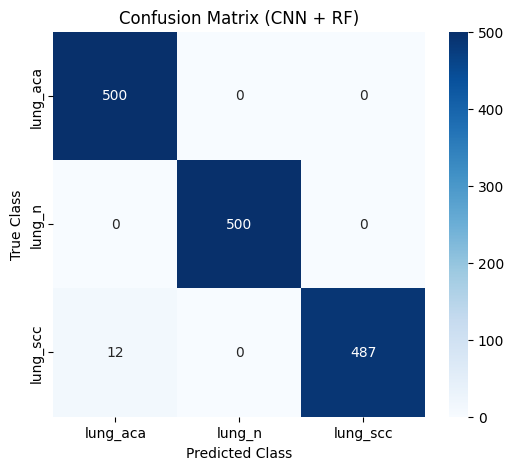
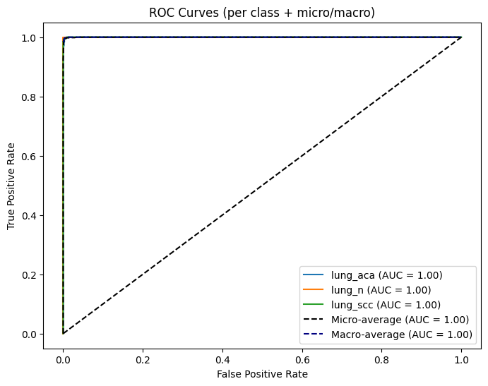
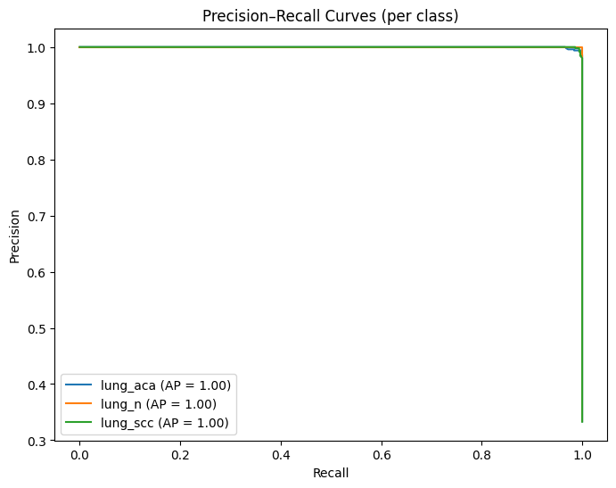
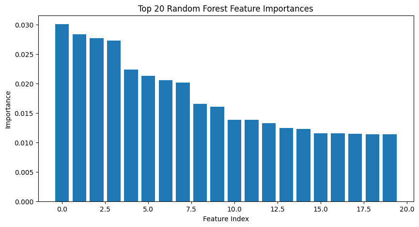
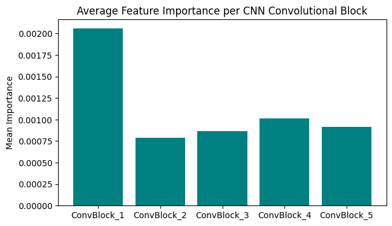

# 🧠 Lung Cancer Detection using CNN and Random Forest

This project presents a **hybrid deep learning and ensemble approach** for classifying lung cancer images into three categories: **Adenocarcinoma (lung_aca)**, **Normal tissue (lung_n)**, and **Squamous Cell Carcinoma (lung_scc)**. 

It combines the **feature extraction capability of a Convolutional Neural Network (CNN)** with the **robust classification power of a Random Forest (RF)** classifier to achieve highly accurate results.

---

## 📘 Overview

Lung cancer remains one of the most prevalent and deadly diseases worldwide. Accurate early-stage classification of lung tissue images can significantly aid in diagnosis and treatment planning.

This study leverages a deep CNN to extract rich spatial features from histopathological images, followed by a Random Forest model for final classification.  

**Final Test Accuracy:** 🟢 **99.20%**  
**Average Cross-Validation Accuracy:** 🟢 **99.82%**

---

## 📚 Dataset

**Source:** [Lung and Colon Cancer Histopathological Image Dataset (LC25000)](https://arxiv.org/abs/1912.12142)

| Attribute | Description |
|------------|-------------|
| **Total Images** | 25,000 |
| **Classes Used** | `lung_aca`, `lung_n`, `lung_scc` |
| **Image Type** | TIF histopathology patches |
| **Input Size** | 60 × 60 pixels |
| **Split** | Training/Validation and Test folders |

> The dataset is organized into separate folders for each class under `Train and Validation Set/` and `Test Set/`.  
> Each folder contains the respective images for that class.

---

## 🧩 Model Architecture

### 🔹 CNN Feature Extractor
A 5-block convolutional neural network (CNN) was used to extract high-level spatial representations:

| Layer Type | Filters | Kernel | Activation | Notes |
|-------------|----------|---------|-------------|-------|
| Conv2D + BN + MaxPool | 32 | 4×4 | ReLU | Basic feature extraction |
| Conv2D + BN + MaxPool | 64 | 4×4 | ReLU | Complex feature extraction |
| Conv2D + BN + MaxPool | 84 | 3×3 | ReLU | High-level features |
| Conv2D + BN + MaxPool | 124 | 3×3 | ReLU | Specific feature capture |
| Conv2D + BN | 124 | 3×3 | ReLU | Final convolutional block |
| GlobalAveragePooling2D | — | — | — | Dimensionality reduction |
| Dense | 1000 | — | ReLU | Feature vector output for RF |

### 🔹 Random Forest Classifier
- Trained on 1000-dimensional CNN feature vectors  
- **200 estimators**, `random_state=42`  
- Trained and validated using **5-Fold Cross-Validation**

---

## 🧪 Experimental Setup

| Component | Description |
|------------|-------------|
| **Frameworks** | TensorFlow / Keras, scikit-learn, NumPy, OpenCV, Matplotlib, Seaborn |
| **Training Environment** | Local environment (VS Code, Python 3.10+) |
| **Image Augmentation** | Rotation (±15°), zoom, horizontal flip, shear, shift |
| **Batch Size** | 32 |
| **Epochs** | 50 |
| **Optimizer** | Adam |
| **Loss Function** | Categorical Crossentropy |

---

## 📈 Results

### ✅ Quantitative Results

| Metric | Value |
|---------|--------|
| **Average 5-Fold CV Accuracy** | 99.82% |
| **Final Test Accuracy (CNN + RF)** | 99.20% |

**Per-Fold Accuracy:**
- Fold 1 → 99.85%  
- Fold 2 → 99.78%  
- Fold 3 → 99.93%  
- Fold 4 → 99.74%  
- Fold 5 → 99.81%

### 🔍 Confusion Matrix

<p align="center">
  
</p>

**Interpretation:**
- The model correctly classifies nearly all instances across all three classes.  
- Minor misclassifications occur between `lung_scc` and `lung_aca`, indicating high discriminative performance overall.

### 📊 ROC Curves

<p align="center">
  
</p>

**Interpretation:**
- All classes achieve perfect AUC scores of 1.00
- Both micro-average and macro-average ROC curves show excellent performance

### 📈 Precision-Recall Curves

<p align="center">
  
</p>

**Interpretation:**
- All classes achieve perfect Average Precision (AP) scores of 1.00
- The model maintains high precision across all recall levels

### 🔬 Feature Importance Analysis

#### Top 20 Random Forest Features
<p align="center">
  
</p>

#### CNN Convolutional Block Importance
<p align="center">
  
</p>

**Interpretation:**
- The Random Forest feature importances reveal that **later convolutional blocks** contribute more to classification decisions
- The **fifth convolutional block** provides the most discriminative features
- Feature importance distribution shows meaningful patterns across different CNN layers

---

## 🎯 Key Observations

- CNN serves as a powerful **feature extractor**, transforming raw images into informative embeddings
- Random Forest enhances robustness, reducing overfitting and improving generalization
- Hybrid CNN-RF pipeline outperforms standalone CNN classifiers in both **accuracy** and **stability**
- Later convolutional blocks in the CNN architecture provide more discriminative features for classification
- The model achieves near-perfect performance across all evaluation metrics

---

## 📊 Evaluation Metrics

- **Accuracy**
- **Precision, Recall, F1-Score**
- **ROC Curves (per-class, micro & macro averages)**
- **Precision-Recall Curves**
- **Feature Importance Visualization**

---

## 🧰 How to Run

### 1️⃣ Clone the Repository
```bash
git clone https://github.com/arafatanam/Lung-Cancer-Detection-using-CNN-and-Random-Forest.git
cd Lung-Cancer-Detection-using-CNN-and-Random-Forest
```

### 2️⃣ Install Dependencies
```bash
pip install tensorflow scikit-learn numpy opencv-python matplotlib seaborn tqdm
```

### 3️⃣ Add Dataset

Download and extract the dataset folder `lung_image_set/` inside the project directory:

```
/lung_image_set
 ├── Train and Validation Set/
 └── Test Set/
```

### 4️⃣ Run the Notebook

Open the `lung_cancer.ipynb` notebook in VS Code or Jupyter and execute all cells sequentially.

---

## 💾 Saved Models

| Model             | File           | Description                                 |
| ----------------- | -------------- | ------------------------------------------- |
| **CNN**           | `cnn_model.h5` | Keras model used for feature extraction     |
| **Random Forest** | `rf_model.pkl` | scikit-learn model for final classification |

You can reload the models as follows:

```python
from tensorflow.keras.models import load_model
import joblib

cnn_model = load_model("cnn_model.h5")
rf_model = joblib.load("rf_model.pkl")
```

---

## 📜 Citation

If you use this work or dataset, please cite the original publication:

> A. A. Abayomi, et al. *Lung and Colon Cancer Histopathological Image Dataset (LC25000)*, arXiv:1912.12142 (2019).
> [https://arxiv.org/abs/1912.12142](https://arxiv.org/abs/1912.12142)

---

## 🧩 Future Work

* Incorporate transfer learning (e.g., ResNet, EfficientNet) for enhanced feature extraction
* Extend the dataset for colon cancer and multi-modal inputs
* Deploy as a clinical decision-support web application
* Explore attention mechanisms for improved interpretability
* Investigate few-shot learning for rare cancer subtypes

---

## 📁 Project Structure

```
lung-cancer-cnn-rf/
├── lung_cancer.ipynb
├── cnn_model.h5
├── rf_model.pkl
├── images/
│   ├── confusion_matrix.png
│   ├── roc_curves.png
│   ├── precision_recall_curves.png
│   ├── feature_importance_top20.png
│   └── conv_block_importance.png
├── lung_image_set/
│   ├── Test Set
│   │   ├── lung_scc
│   │   ├── lung_n
│   │   └── lung_aca
│   └── Train and Valication Set
│       ├── lung_scc
│       ├── lung_n
│       └── lung_aca
└── README.md
```